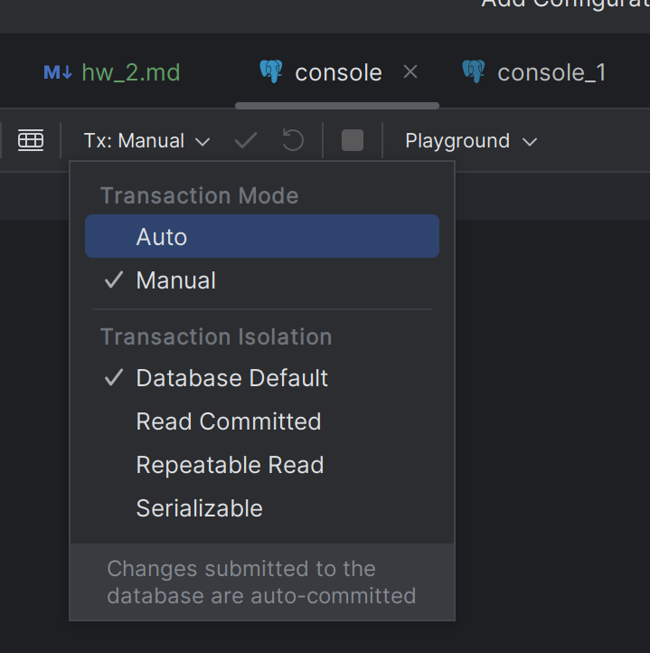

 ДЗ Пошаговая инструкция:
1. Открыл в Goland две консоли под пользователем postgres 
2. В первой сессии создал таблицу pets 
3. Наполнил таблицу данными 
4. Текущий уровень изоляции: `read committed` 
5. В первой сессии добавил новую запись 
6. Во второй сессии новой записи не видно 
Это происходит т.к. уровень изоляции `read commited` позволяет читать только те изменения, которые мы закоммитили
7. В первой консоли выполняем `commit;` и снова выбираем все записи во второй консоли: новая строка появилась 
8. В обеих консолях начал новые транзакции с уровнем изоляции `repeatable read`
9. В первой сессии добавил новую запись: 
10. При выборе всех записей во второй консоли новая запись не видна. 
Это происходит т.к. уровень изоляции `repeatable read` не позволяет видеть изменения,
совершенные в конкурентных транзакциях. 
11. После завершения первой транзакции во второй консоли изменения всё равно не видны.
Это происходит потому что после начала транзакции с уровнем изоляции `repeatable read` 
мы будем работать с базой в том состоянии, в котором она была в момент начала транзакции

      

[Код из консоли 1](./assets/sql/hw_2_1.sql)
