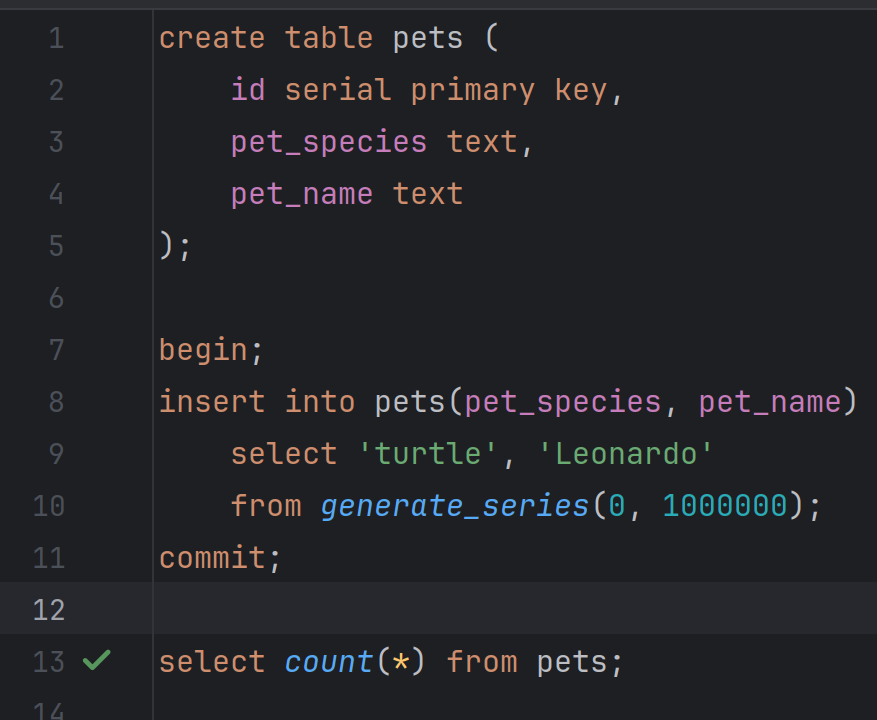
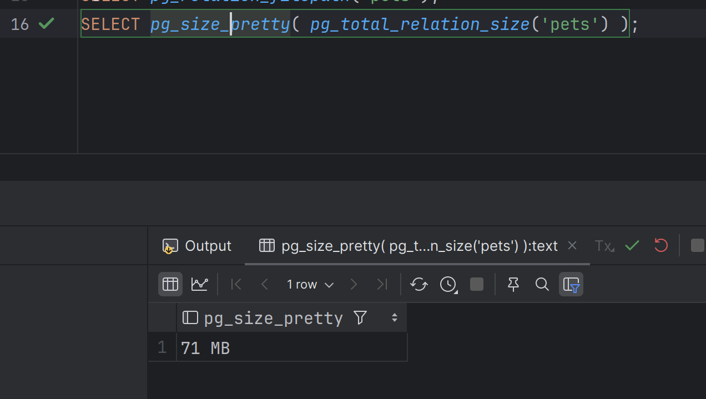
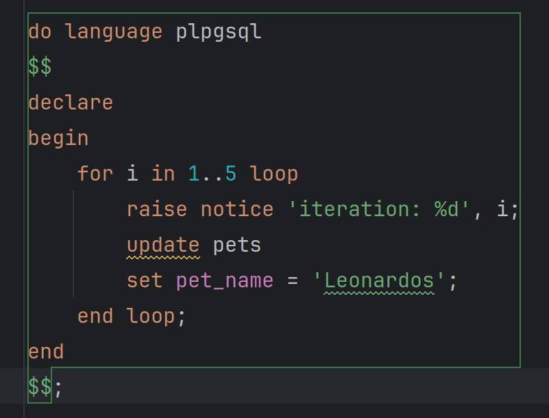
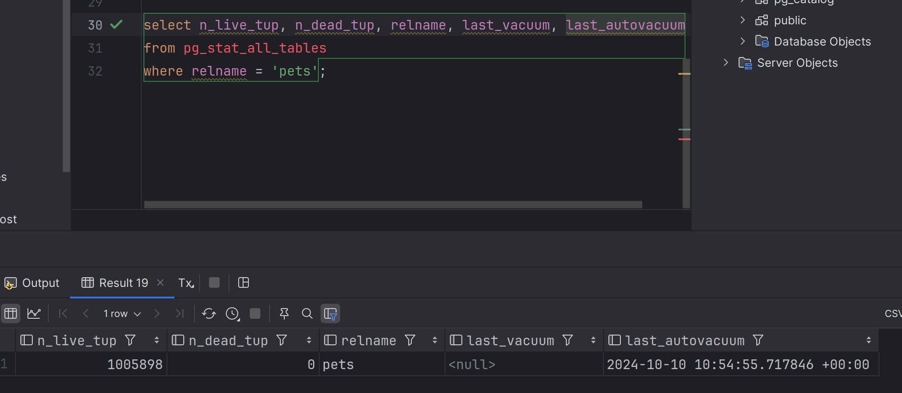
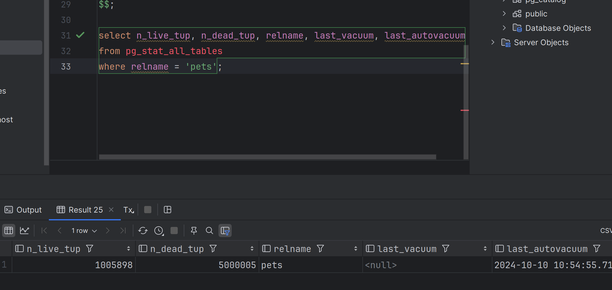

1. Создал таблицу и наполнил её миллионом строк 
   
   

2. Общий размер таблицы - 71 МБ

   

3. Обновил все записи в таблице, добавив символ к имени питомца

   

4. Теперь размер таблицы составляет 384 МБ, число мертвых строк - 0, последний автовакуум проходил 15 мин назад
(подозреваю, что почти сразу после обновления всех записей)

   

5. Подождал ещё 15 мин, ничего не произошло)
6. Обновил 5 раз все строчки и сразу проверил число мертвых строк, в этот раз оно составляет 5 000 000 

   

   Размер таблицы составляет так же 384 МБ

   Через пару минут произошел автовакуум: число мертвых строк теперь 0, а размер таблицы уменьшился до 335 МБ

7. Выключил автовакуум на таблице `pets`: `alter table pets set (autovacuum_enabled = off);`

8. После 10 обновлений всех строк число мертвых строк теперь составляет 10 000 000, размер файла с таблицей - 676 МБ.
   Такой результат объясняется тем, что при отключенном автовакууме у нас не происходит очистка таблицы от мертвых строк

9. Включил автовакуум `alter table pets set (autovacuum_enabled = on);`

   Через несколько минут он выполнился, но общий размер таблицы всё так же составил 676 МБ. 
   Через какое-то время снова проверил размер таблицы и даже вручную вызвал вакуум, но размер не уменьшился (число мертвых строк - 0).
   Предположу что это происходит т.к. постгрес считает, что это место ещё может пригодиться и не освобождает его, чтоб не выделять заново в будущем.
   
Код анонимной процедуры для обновления всез строк таблицы

      do language plpgsql
      $$
      declare
      begin
         for i in 1..10 loop
            raise notice 'iteration: %', i;
            update pets
            set pet_name = 'Raphael';
         end loop;
      end
      $$;

