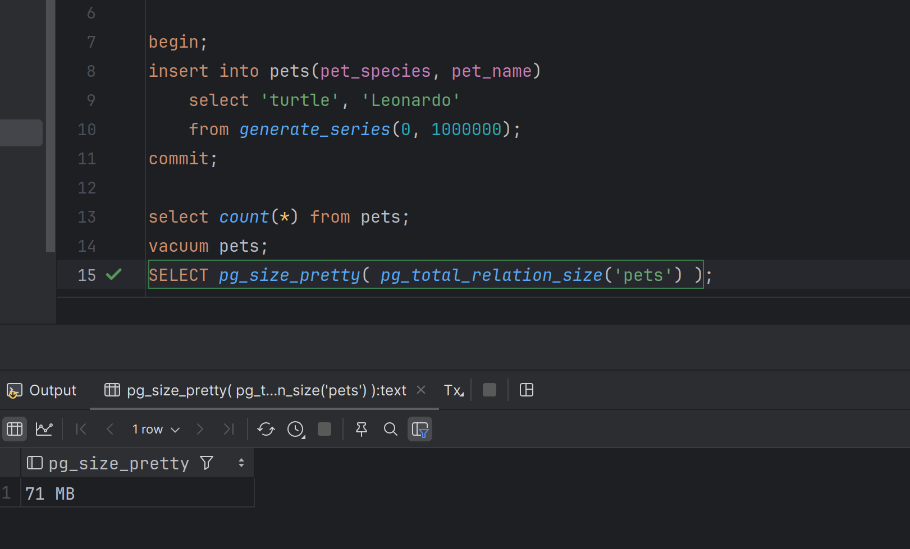

### Уменьшение размера таблицы после автовакуума

Воспроизведение (Postgres 17, Docker, стандартная консоль из JetBrains GoLand IDE)

1. Наполняем таблицу миллионом записей: размер 74 МБ

    

2. Обновляем все записи 5 раз
3. Получаем 5 000 000 мертвых строк и размер таблицы 384 МБ

   

   

4. Ждем пока пройдет автовакуум. Число мертвых строк: 0, размер таблицы: 384 МБ

   

   

5. Снова обновляем все записи 5 раз
   

6. Число мертвых строк: 5 000 000, размер: 384 МБ
   
   
   
   
   
7. Прошел автовакуум: число мертвых строк 0, размер таблицы: 335 МБ

   

   

[SQL запросы](./assets/sql/hw_3_1_1.sql)