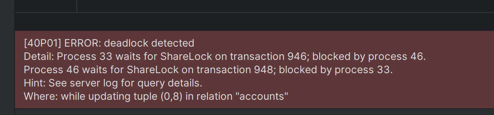
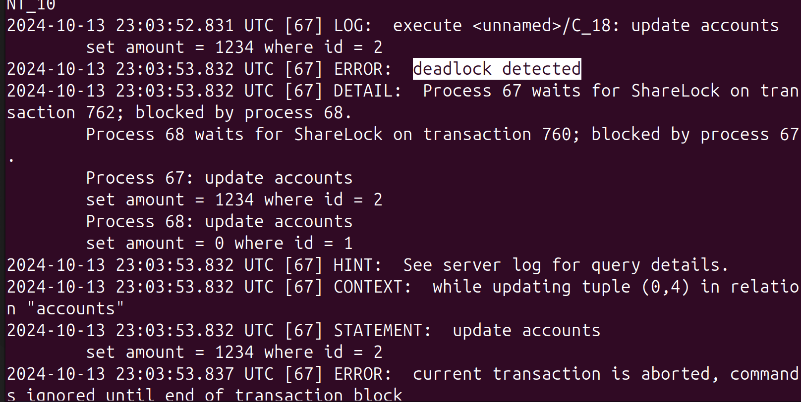

1. Создаю таблицу `accounts`

       create table accounts(
            id int,
            amount numeric
       )

2. Добавляю несколько записей:

         insert into accounts(id, amount) values (1, 500);
         insert into accounts(id, amount) values (2, 1000);
         insert into accounts(id, amount) values (3, 1000000);

3. Чтобы получить состояние дедлока выполним следующие запросы в двух параллельных транзакциях

    | Транзакция 1                                                           | Транзакция 2                                                     |
    |------------------------------------------------------------------------|------------------------------------------------------------------|
    | `begin;`                                                               | `begin;`                                                         |
    | <code> update accounts   set amount = 1234 where id = 1; </code>    | <code> update accounts   set amount = 0 where id = 2; </code> |
    | <code> update accounts   set amount = 1234 where id = 2; </code>    | <code> update accounts   set amount = 0 where id = 1; </code> |

    

    По итогу транзакция 1 будет ожидать завершения транзакции 2, а транзакция 2 - завершения транзакции 1.
    Очевидно, что время ожидания в такой ситуации будет бесконечным (получаем дедлок!)

4. Командой `docker logs postgres_container` смотрю логи сервера

    
