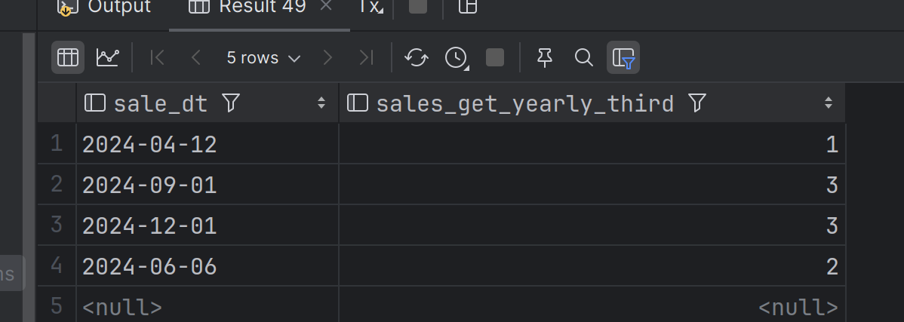

## Выбор трети года

1. Создаём таблицу продаж

       create table sales(
       sale_id serial primary key,
       sale_dt date
       );
2. Заполняем тестовыми данными

    `insert into sales values (default, '2024-04-12'), (default, '2024-09-01'), (default, '2024-12-01'), (default, '2024-06-06'), (default, null);`

3. Функция выбора трети года выглядит следующим образом: 

    
    create function sales_get_yearly_third(_sale_id int) returns integer as
    $$
    declare
        dt date;
    begin
        select sale_dt  from sales where sale_id = _sale_id into dt;
        case
            when dt is null then return null;
            when dt < '2024-05-01'::date then return 1;
            when dt < '2024-09-01'::date then return 2;
            when dt <= '2024-12-31'::date then return 3;
        end case;
    end;
    $$
    language plpgsql;

4. При помощи следующего запроса применим функцию ко всем записям в таблице

   `select sales.sale_dt, sales_get_yearly_third(_sale_id := sales.sale_id) from sales;`
5. Получаем следующий результат:
    

Работает корректно