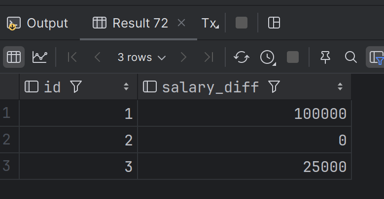

## Запрос с оконными функциями

Схема таблиц с [DBFiddle](https://www.db-fiddle.com/f/eQ8zNtAFY88i8nB4GRB65V/0)

Текст запроса (в более удобночитаемом виде по [ссылке](./assets/sql/hw_9.sql): 

    with latest_salaries as (
    select id, amount
    from employee,
         lateral
         ( select amount
           from salary
           where fk_employee = id
           order by to_date desc
           limit 1
             )
    group by id, amount
    ), previous_salaries as (
        select id, amount
        from employee,
        lateral
        (   select lag(amount) over (partition by fk_employee) as amount
            from salary
            where fk_employee = id
            order by to_date desc
            limit 1
        )
        group by id, amount
    )
    select latest_salaries.id, coalesce(latest_salaries.amount - previous_salaries.amount, 0) as salary_diff
    from previous_salaries join latest_salaries on latest_salaries.id = previous_salaries.id;

Результат (к данным из fiddle добавил строку с повышением employee_id = 3 на 25к)

 